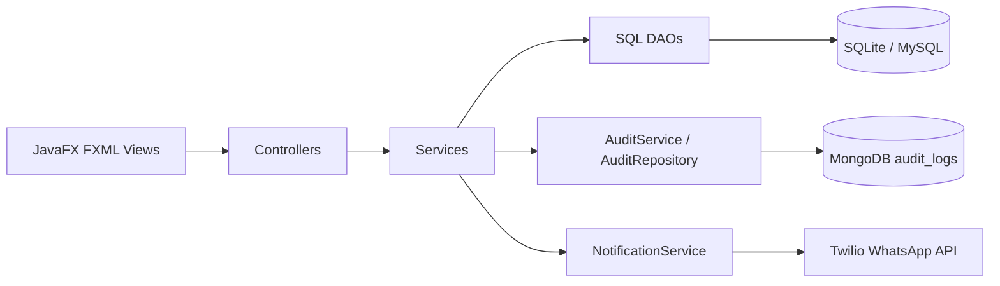
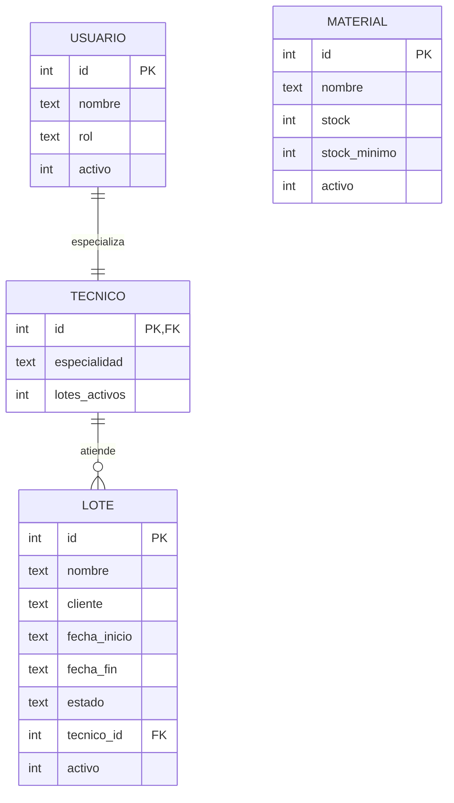
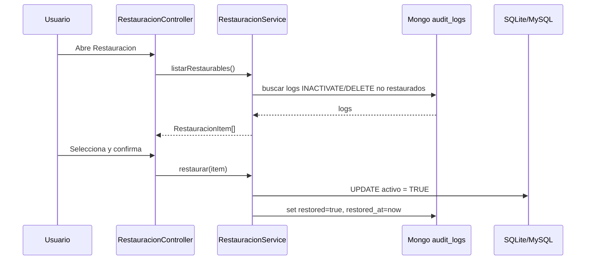

# Handoff Tecnico - CiberLightCol

## 1. Resumen Ejecutivo

CiberLightCol es una aplicacion de escritorio JavaFX para administrar lotes de produccion, tecnicos y materiales. La persistencia transaccional principal usa SQL, actualmente SQLite por defecto. MongoDB se usa como respaldo/auditoria operacional para guardar el estado anterior de registros inactivados y permitir restauracion desde la UI. Twilio se integra como API externa para enviar notificaciones WhatsApp sobre eventos operativos.

La aplicacion no expone una API HTTP propia. Cuando este documento habla de "API", se refiere a la integracion saliente con Twilio Programmable Messaging.

## 2. Stack Tecnico

- Lenguaje: Java 21.
- UI: JavaFX 21 con FXML.
- Build: Maven.
- Base relacional: SQLite por defecto, MySQL configurable.
- Base documental: MongoDB.
- API externa: Twilio WhatsApp Messaging.
- Configuracion local: `application.properties`, variables de entorno y `.env`.

## 3. Arquitectura

La aplicacion sigue una arquitectura por capas:



Responsabilidades:

- `controller`: maneja eventos UI, carga tablas, valida seleccion y muestra alertas.
- `service`: contiene reglas de negocio y coordina auditoria/notificacion.
- `dao`: ejecuta SQL contra la base seleccionada.
- `audit`: guarda y consulta documentos MongoDB.
- `config`: resuelve propiedades desde system properties, variables de entorno, `.env` y `application.properties`.

## 4. Configuracion

Orden de lectura para una clave:

1. System property Java: `-Dclave.valor=...`
2. Variable de entorno: `CLAVE_VALOR`
3. `.env`: `CLAVE_VALOR=...`
4. `application.properties`
5. Valor por defecto del codigo

Ejemplo:

```properties
db.type=sqlite
db.sqlite.url=jdbc:sqlite:db_ciberlightsqlite
mongo.uri=mongodb://172.30.16.238:27017/?serverSelectionTimeoutMS=3000
mongo.database=ciberlight_backup
```

Twilio debe vivir en `.env`, no en codigo:

```env
TWILIO_ENABLED=true
TWILIO_ACCOUNT_SID=AC...
TWILIO_API_KEY_SID=SK...
TWILIO_API_KEY_SECRET=...
TWILIO_FROM_WHATSAPP=+14155238886
TWILIO_TO_WHATSAPP=+57...
```

## 5. Modelo Entidad Relacion

Modelo relacional real usado por SQLite:



Entidades:

- `usuario`: datos generales y rol. Los tecnicos son usuarios con rol `TECNICO`.
- `tecnico`: extension de usuario, contiene especialidad y contador de lotes activos.
- `material`: inventario con stock actual y minimo.
- `lote`: unidad de trabajo asociada a un tecnico.

El borrado funcional no elimina filas; cambia `activo` a falso.

## 6. Modelo de Datos MongoDB

Base: `ciberlight_backup`

Coleccion: `audit_logs`

Documento general:

```json
{
  "_id": "ObjectId",
  "table": "material | lote | tecnico",
  "action": "INACTIVATE | DELETE | CREATE | UPDATE",
  "timestamp": "2026-05-27T12:30:00.000",
  "old_data": {},
  "new_data": null,
  "restored": true,
  "restored_at": "2026-05-27T12:45:00.000"
}
```

Ejemplo `material`:

```json
{
  "table": "material",
  "action": "INACTIVATE",
  "timestamp": "2026-05-27T12:30:00",
  "old_data": {
    "id": 4,
    "nombre": "Cable UTP",
    "stock": 2,
    "stockMinimo": 5
  },
  "new_data": null
}
```

Ejemplo `lote`:

```json
{
  "table": "lote",
  "action": "INACTIVATE",
  "old_data": {
    "id": 10,
    "nombre": "Lote A-10",
    "cliente": "Cliente Demo",
    "fechaInicio": "2026-05-27",
    "fechaFin": null,
    "estado": "EN_PROCESO",
    "tecnico": {
      "id": 2,
      "nombre": "Tecnico Uno"
    },
    "activo": true
  }
}
```

Ejemplo `tecnico`:

```json
{
  "table": "tecnico",
  "action": "INACTIVATE",
  "old_data": {
    "id": 2,
    "nombre": "Tecnico Uno",
    "rol": "TECNICO",
    "especialidad": "Fibra",
    "lotesActivos": 0
  }
}
```

Notas:

- `DocumentMapper` convierte objetos Java a `Document` usando reflexion.
- Enums se guardan como texto.
- Fechas se guardan como texto ISO.
- La restauracion filtra acciones `INACTIVATE` y `DELETE` con `restored != true`.
- Al restaurar, se actualiza el registro SQL y luego el log Mongo con `restored=true`.

## 7. Restauracion

Flujo:



Restauracion soportada:

- `material`: `UPDATE material SET activo = TRUE WHERE id = ?`
- `lote`: `UPDATE lote SET activo = TRUE WHERE id = ?`
- `tecnico`: `UPDATE usuario SET activo = TRUE WHERE id = ?`

Si MongoDB no esta disponible, la pantalla muestra un error controlado y no rompe el FXML.

## 8. Arquitectura de la API Twilio

La aplicacion consume Twilio como API externa saliente. No hay backend HTTP propio.

Endpoint usado:

```text
POST https://api.twilio.com/2010-04-01/Accounts/{TWILIO_ACCOUNT_SID}/Messages.json
```

Autenticacion:

- Basic Auth.
- Usuario: `TWILIO_API_KEY_SID` si existe; si no, `TWILIO_ACCOUNT_SID`.
- Password: `TWILIO_API_KEY_SECRET` si existe; si no, `TWILIO_AUTH_TOKEN`.

Formato enviado:

```text
From=whatsapp:+14155238886
To=whatsapp:+57...
ContentSid=HX...
ContentVariables={"1":"valor","2":"valor"}
```

Templates configurados:

| Evento | Template SID | Variables |
|---|---|---|
| Stock minimo | `HX934c91515643712dc8f708bf61648bf8` | `1=material`, `2=stock actual` |
| Inicio de lote | `HX3eddc56a7cf3160163daa065a022d873` | `1=lote`, `2=tecnico` |
| Finalizacion de lote | `HX69811128c607414adbe80136ffe5a0cd` | `1=lote`, `2=tecnico` |

Modelo de datos API:

```json
{
  "from": "whatsapp:+14155238886",
  "to": "whatsapp:+573026978240",
  "contentSid": "HX...",
  "contentVariables": {
    "1": "Nombre dinamico",
    "2": "Valor dinamico"
  }
}
```

Eventos que disparan notificacion:

- `MaterialService.salidaStock`: si el material cruza desde stock normal hacia stock menor al minimo.
- `LoteService.crear`: cuando se crea un lote en estado `EN_PROCESO`.
- `LoteService.finalizar`: cuando el lote cambia a `FINALIZADO`.

## 9. Transacciones y Consistencia

### Tecnicos

`TecnicoDAO.insertar` usa transaccion SQL manual:

1. `conn.setAutoCommit(false)`
2. Inserta en `usuario`.
3. Obtiene ID generado.
4. Inserta en `tecnico`.
5. `conn.commit()`

Riesgo actual: si ocurre excepcion, no hay rollback explicito. Recomendacion: agregar `conn.rollback()` en catch.

### Inactivacion

Para `material`, `lote` y `tecnico`:

1. Buscar registro actual.
2. Guardar `old_data` en MongoDB.
3. Cambiar `activo = FALSE` en SQL.

Comportamiento actual: si MongoDB falla, la inactivacion se bloquea para evitar perder respaldo restaurable.

### Restauracion

1. Reactivar registro en SQL.
2. Marcar log Mongo como restaurado.

Riesgo actual: si SQL se actualiza y falla Mongo al marcar `restored=true`, el item podria seguir apareciendo como restaurable. Recomendacion: agregar validacion previa de estado activo o una transaccion/compensacion mas robusta.

### Stock

`MaterialDAO.disminuirStock` es atomico a nivel SQL:

```sql
UPDATE material
SET stock = stock - ?
WHERE id = ? AND stock >= ?
```

Evita stock negativo incluso si dos operaciones ocurren muy cerca.

## 10. Flujos de Negocio

### Materiales

- Crear material con nombre, stock inicial y stock minimo.
- Entrada de stock: aumenta stock.
- Salida de stock: disminuye stock si hay cantidad suficiente.
- Si despues de salida el stock queda por debajo del minimo y antes estaba normal, envia WhatsApp.
- Eliminar material: audita en Mongo e inactiva.

### Lotes

- Crear lote asociado a tecnico.
- El lote inicia con `fecha_inicio=now`, `estado=EN_PROCESO` y `activo=true`.
- Al crear, envia WhatsApp de inicio.
- Finalizar lote: cambia estado a `FINALIZADO`, asigna `fecha_fin=now` y envia WhatsApp.
- Eliminar lote: audita en Mongo e inactiva.

### Tecnicos

- Crear tecnico inserta `usuario` y `tecnico`.
- Inactivar tecnico audita en Mongo y cambia `usuario.activo=false`.
- Restaurar tecnico reactiva `usuario.activo=true`.

## 11. Seguridad

- No versionar `.env`.
- Rotar credenciales Twilio si fueron compartidas por chat o capturas.
- Mover credenciales MySQL hardcodeadas desde defaults a `.env` en una siguiente mejora.
- Limitar IP de MongoDB si se despliega en red compartida.
- Evitar imprimir cuerpos completos de error Twilio en produccion si contienen informacion sensible.

## 12. Verificacion

Verificacion realizada durante el handoff:

- Compilacion manual con `javac 21` usando dependencias locales de Maven.
- `mvn test` no se pudo ejecutar porque `mvn` no esta disponible en PATH de la maquina.

Comandos recomendados:

```bash
mvn test
mvn clean javafx:run
```

Pruebas manuales recomendadas:

1. Abrir `Restauracion` con MongoDB encendido.
2. Inactivar un material y confirmar que aparece en restauracion.
3. Restaurar el material y confirmar que vuelve a `Materiales`.
4. Bajar stock por debajo del minimo y verificar WhatsApp.
5. Crear lote y verificar WhatsApp de inicio.
6. Finalizar lote y verificar WhatsApp de finalizacion.

## 13. Pendientes Recomendados

- Agregar rollback explicito en `TecnicoDAO.insertar`.
- Registrar auditoria tambien para creacion/finalizacion si se quiere trazabilidad completa.
- Evitar duplicados en restauracion si un registro fue inactivado varias veces.
- Agregar columna visible de estado de conexion Mongo/Twilio.
- Agregar pruebas unitarias para `RestauracionService` y `NotificationService`.
- Normalizar encoding de textos con caracteres especiales en FXML y Java.
- Actualizar MySQL schema para que coincida con SQLite schema.
